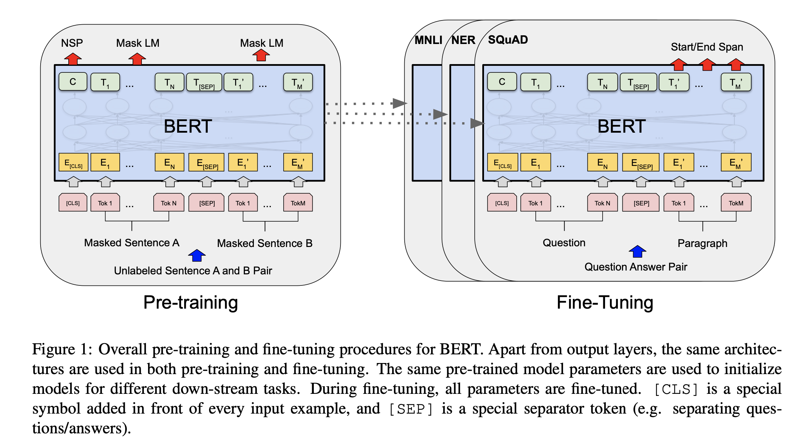
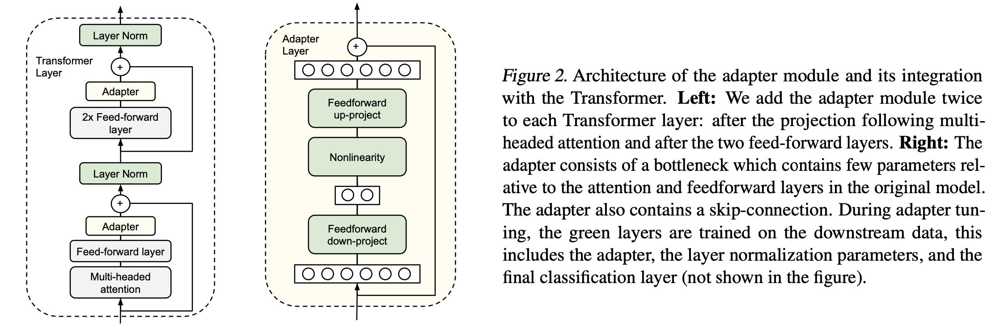

# Aspect-term extraction and Aspect-based sentiment analysis
 
# Introduction

Sentiment analysis, i.e. the analysis of the feeling expressed in a sentence, is a leading application area in natural language processing. Indeed, it has attract the interest of brands, which are interesent analyzing customer feedback, such as opinions in survey responses and social media conversations, so that they can tailor products and services to meet their customers’ needs.

Nevertheless, basic sentiment analysis attempt to detect the overall polarity of a sentence irrespective of the entities mentioned and their aspects. Therefore, a new task has been introduced: Aspect-based sentiment analysis (ABSA), a text analysis technique that categorizes data by aspect and identifies the sentiment attributed to each one. 

In this repository, we provide a possible solution to two steps of ABSA:
1. Aspect term extraction (ATE);
2. Aspect-based sentiment analysis (ABSA).

# Task description

Let us consider a given sentence $s$, coming for instance from a review of a product or a social media post.
A company could be interested in getting to know the major sentiment of the sentence, i.e. whether it is positive, negative or neutral, w.r.t. each of the most important aspects of the sentence.

For example, the sentence "The food was delicious, but the prices were a bit high" has two different polarities to point out, each of which is attributed to a different aspect. Indeed, the sentiment concerning the **food** is positive, while the sentiment concerning the **prices** is negative, and both these informations could be separately interesting to a company.

Thus, in order to extract such information, we need to first identify the aspects of the sentence, and then to extract the sentiment associated to each of them. These are the two separated tasks we are going to approach in this work.

1. Aspect-based term extraction (ABTE): given sentence, identify all apect terms present in the sentence;
2. Aspect-based sentiment analysis (ABSA): given sentence and an aspect term, identify the sentiment associated to that aspect term.

Clearly, the first task can be seen as a preprocessing step in order to perform the second task, thus, if we deal with data in which the aspects are not manually annotated we should perform ATE and then ABSA. On the other hand, ifthe aspects are already manually annotated, we can directly perform ABSA in order to extract the sentiment associated to each aspect.


# Dataset

In order to train and test our models we use a dataset containing restaurant reviews, taken from a preprocessed version, available at [1], of the SemEval-2014 ABSA Task [2].

Data are organized in a csv file, with the following columns:
- **Tokens**: tokenized sentence;
- **Tags**: list of tags associated to each token: '0' for non-aspect terms, '1' for beginning of terms and '2' for marks of terms;
- **Polarities**: list of polarities associated to each token: '0' for negative, '1' for neutral and '2' for positive and '-1' for non-aspect terms;

# Models

To solve the problems described above, we provide different strategies, all based on the fine-tuning of a pretrained BERT model [3], with the implementation provided by Hugging Face [4].
BERT is a bidirectional transformer pretrained using a combination of masked language modeling objective and next sentence prediction, which can be adapted to a wide range of tasks, including sentiment analysis.

### Architecture

Both tasks are approached with two different BERT based approaches: a straighforward fine-tuning and an adapter, implementation provided by AdapterHub[5].

1. **Fine-tuning** consist of taking pretrained model ('bert-base-uncased' in our case) and train in specifically for ATE and ABSE. Thus, the idea is to update the entire copy of the original pretrained model, which turns out to be not efficient. See Figure 1 below [3] for a summary of the model architecture for fine-tuning:

<p align="center">
  
</p>

2. **Adapter modules** have been introduced [6] as a more efficient approach than fine-tuning. In this scenario, the parameters of the original model are fixed, and one has to train only a few trainable parameters per task: these new task-specific parameters are called adaptors. See Figure 1 below [6] for a summary of the adapter architecture: 

<p align="center">
  
</p>

In particular, for ATE we feed the transormer with the list of indeces of words in the vocabulary. On the other hand, in ABSE we first concatenate the aspect with the list of sentence tokens as follows:
```{note}
    ['w1', 'w2', 'w3', ... , 'wN', '[CLS]', 'aspect']
```
Then we feed the transformer with the list of indeces of words in the vocabulary.


### Optimization strategy and training

Finally, we provide two different optimization strategies, both based on the AdamW algorithm [7], with the implementation provided in Pyorch [8].
Moreover, we test both AdamW with a fixed learning rate and with a a learning rate schedueler, linear for ATE and polynomial for ABSE.

Training is performed with a batch size of 8, and 5 epochs for all the cases, as suggested for BERT models. While ATE is trained with $3\,10^{-5}$ learing rate, ABSE is trained with $10^{-3}$ learning rate since the second approach shows a less stable trend.


## Overview
The main notebook is structured as follows:
1. Text preprocessing and normalization;
2. Aspect term extraction: training overview and comparison, testing, evaluation, and visualization;
3. Aspect-based sentiment analysis:  training overview and comparison, testing, evaluation, and visualization.

Since we trained 8 different models, training has been performed separately and loaded in the notebook. Nevertheless, we show the process of training by means of a plot of the training loss.

## Results:

Best setup in terms of variance-bias tradeoff for Aspect-terms extraction is with adapter+scheduler:

| TEST ADAPTER + SCHEDULER |           |        |          |         |   | Train ADAPTER + SCHEDULER |           |        |          |         |
|--------------------------|-----------|--------|----------|---------|---|---------------------------|-----------|--------|----------|---------|
|                          | precision | recall | f1-score | support |   |                           | precision | recall | f1-score | support |
| none                     | 0.98      | 0.99   | 0.98     | 65477   |   | none                      | 0.98      | 0.99   | 0.98     | 227086  |
| start of AT              | 0.70      | 0.68   | 0.69     | 4022    |   | start of AT               | 0.69      | 0.66   | 0.68     | 11416   |
| mark of AT               | 0.83      | 0.61   | 0.70     | 2141    |   | mark of AT                | 0.78      | 0.67   | 0.72     | 4710    |
| accuracy                 | 0.96      | 71640  | accuracy | 0.96    |   | 243212                    |           |        |          |         |
| macro avg                | 0.83      | 0.76   | 0.79     | 71640   |   | macro avg                 | 0.82      | 0.77   | 0.79     | 243212  |
| weighted avg             | 0.96      | 0.96   | 0.96     | 71640   |   | weighted avg              | 0.96      | 0.96   | 0.96     | 243212  |
	 

## References:

[1] **Aspect-Term-Extraction-and-Analysis**, https://github.com/1tangerine1day/Aspect-Term-Extraction-and-Analysis

[2] Maria Pontiki, Dimitris Galanis, John Pavlopoulos, Harris Papageorgiou, Ion Androutsopoulos, and Suresh Manandhar. 2014. **SemEval-2014 Task 4: Aspect Based Sentiment Analysis.** In Proceedings of the 8th International Workshop on Semantic Evaluation (SemEval 2014), pages 27–35, Dublin, Ireland. Association for Computational Linguistics.

[3] Devlin, Jacob and Chang, Ming-Wei and Lee, Kenton and Toutanova, Kristina, **BERT: Pre-training of Deep Bidirectional Transformers for Language Understanding**, DOI: 10.48550/ARXIV.1810.04805

[4] **HuggingFace BERT models**, https://huggingface.co/docs/transformers/model_doc/bert

[5] **AdapterHub: A Framework for Adapting Transformers**, Jonas Pfeiffer et al., Proceedings of the 2020 Conference on Empirical Methods in Natural Language Processing (EMNLP 2020): Systems Demonstrations, https://www.aclweb.org/anthology/2020.emnlp-demos.7

[6] Houlsby, Neil and Giurgiu, Andrei and Jastrzebski, Stanislaw and Morrone, Bruna and de Laroussilhe, Quentin and Gesmundo, Andrea and Attariyan, Mona and Gelly, Sylvain, **Parameter-Efficient Transfer Learning for NLP**, DOI: 10.48550/ARXIV.1902.00751

[7] Loshchilov Ilya, Hutter Frank, **Decoupled Weight Decay Regularization**, DOI: 10.48550/ARXIV.1711.05101

[8] PyTorch: An Imperative Style, High-Performance Deep Learning Library}, Paszke Adam,  Gross Sam, Massa Francisco, Lerer Adamm, Bradbury James, Chanan Gregory, Killeen Trevor, Lin Zeming, Gimelshein Natalia, Antiga Luca, Desmaison Alban, Kopf Andreas, Yang Edward, DeVit Zachary, Raison Martin, Tejani Alykhan, Chilamkurthy Sasank, Steiner Benoit, Fang Lu, Bai Junjie, Chintala Soumith, http://papers.neurips.cc/paper/9015-pytorch-an-imperative-style-high-performance-deep-learning-library.pdf

## Aknowledgements

The general structure of the model (i.e. padding, dataset construction...) has been taken from [1], nevetheless we organized the model into a user-friendly class structure which provides a simple interface to the model. Moreover, we changes the optimization strategy, using AdamW instead of a generic Adam, introducing the learning rate scheduling and Adapter option as an alternative to fine-tuning.
